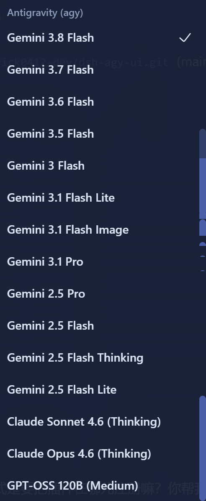

# dsh-agy-ui

<p align="center">
  <strong>专为 DeepSeek Harness (DSH) 中 <code>dsh-agy</code> 打造的非侵入式 UI 伴生增强插件</strong><br/>
  模型列表智能净化 · 顶栏实时配额徽章 · 毛玻璃双周期额度浮层 · 移动端抽屉自适应
</p>

<p align="center">
  <a href="https://www.npmjs.com/package/dsh-agy-ui"></a>
  <a href="./LICENSE"></a>
  <a href="https://github.com/deepseek-ai/deepseek-harness"></a>
  <a href="https://github.com/Erick0412-dev/dsh-agy-ui/pulls"></a>
</p>

<p align="center">
  <b>🌐 语言 / Language:</b>
  <b>简体中文</b> ·
  <a href="./README.en.md">English</a>
</p>

---

## 💡 为什么需要 dsh-agy-ui？

在 [DeepSeek Harness (DSH)](https://github.com/deepseek-ai/deepseek-harness) 生态中，[dsh-agy](https://github.com/chaos-03x/dsh-agy) 凭借直连 Google 内部核心 API（`POST /v1internal:streamGenerateContent`）以及 DSH 原生 Tool 执行能力，提供了轻量极速的底层调用通道。

但原生使用中存在几个直接影响日常体验的痛点：

| 对比维度 | 原生 `dsh-agy` 体验 | 配合 `dsh-agy-ui` 增强后 |
| :--- | :--- | :--- |
| **模型列表选择** | 充斥内部幽灵模型（如 `chat_23310`、`tab_flash_lite_preview`） | 🧹 **自动正则净化**，彻底过滤非通用对话模型 |
| **思考档位 (Reasoning)** | 同一模型的 Low/Medium/High 被展开为多行冗长菜单 | 🎛️ **智能折叠变体**，无缝唤起 DSH 原生思考档位选择器 |
| **Tiered 模型命名** | 原始模型 ID 显示粗糙（如 `gemini-3.8-flash-tiered`） | ✨ **规范品牌化排版**，展示为 `Gemini 3.8 Flash` 等友好名称 |
| **模型优先级** | 排序散乱，主力模型难以快速定位 | 🏆 **标准优先级降序**：3.8 Flash > 3.7 > 3.6 > Pro > Claude > GPT-OSS |
| **配额感知** | 额度孤立在 `/agy` 后台管理页，对话界面无法获知 | ⚡ **顶栏常驻微型徽章**，常态直接透视 Gemini 5h 剩余配额 |
| **额度详情查看** | 需离开当前对话跳转后台 | 🪟 **悬停/点击呼出毛玻璃浮层**，直观展示 5小时周期 + 7天周额度 |
| **移动端适配** | 桌面浮层在窄屏下容易截断或溢出 | 📱 **响应式抽屉 (Drawer)**，屏幕 $\le$ 640px 自动滑出底部卡片 |

`dsh-agy-ui` 定位为一个**纯表层体验伴生增强插件**：底层网络通信、流式解析与 Tool 调度 100% 交由 `dsh-agy`，本插件专注于提供优雅直观的前端交互。

---

## 🏛️ 插件定位与系统架构

`dsh-agy-ui` 遵循 Cordis 插件规范设计，在内存中以非侵入方式包裹 LLM 适配器，并在 Web 端通过 DSH 原生 Slots 插槽注入交互组件：

```text
                    ┌────────────────────────────────────────────────────────┐
                    │               DeepSeek Harness (DSH Web)               │
                    └───────────┬────────────────────────────────┬───────────┘
                                │                                │
                        (Web Slots 注入)                 (Cordis 插件机制)
                                │                                │
                                ▼                                ▼
                    ┌────────────────────────┐      ┌─────────────────────────┐
                    │      dsh-agy-ui        │◄─────┤   适配器列表动态拦截包装  │
                    │   (顶栏徽章 + 浮层弹窗)  │      │ (净化/折叠/品牌化/排序)   │
                    └───────────┬────────────┘      └────────────┬────────────┘
                                │ HTTP 状态读取                   │ 原生模型委托
                                ▼                                ▼
                    ┌────────────────────────┐      ┌─────────────────────────┐
                    │   dsh-agy 后台 API     │      │   dsh-agy 核心调用层    │
                    │  (/agy/api/accounts)   │      │ (直连 Google 内部 API)  │
                    └────────────────────────┘      └─────────────────────────┘
                                ▲
                                │ 兼容读取（可选共存）
                    ┌───────────┴────────────┐
                    │      dsh-agy-link      │
                    │ (/plugins/agy-link/..) │
                    └────────────────────────┘
```

---

## ✨ 核心特性详解

### 1. 🧼 模型菜单智能净化与统一排版

<p align="center">
  
  <br />
  <em>▲ 净化后的 Antigravity (agy) 原生模型选择列表效果预览</em>
</p>

- **内部幽灵模型过滤**：自动过滤 `^chat_\d+$`、`^tab_` 等非对话专用的内部调试与代码补全模型。
- **思考档位规范折叠**：将散落的 `-low`、`-medium`、`-high` 变体收敛至根模型，注入标准的 `thinkingEfforts` 声明，让 DSH 原生思考选择器生效。
- **品牌名称优雅规范**：将 Tiered 系列模型（如 `gemini-3.8-flash-tiered`）自动格式化为标准展示名（如 `Gemini 3.8 Flash`）。
- **科学降序排列**：Gemini Flash 系列（3.8 > 3.7 > 3.6 > 3.5 > 3）→ Gemini Pro（3.1 Pro）→ 2.5 系列 → Claude 4.6 → GPT-OSS。

### 2. ⚡ 顶栏实时配额徽章 (Header Badge)
- **非侵入插槽注入**：挂载于 `conversation.session.header.actions` 插槽，独立 ID `agy-ui-quota-badge`。
- **一目了然的配额显示**：常驻显示当前活跃账号的 Gemini 5 小时配额（如 `AGY · 80%`）。
- **动静相宜的呼吸微动效**：静态健康圆点平时稳定常亮（绿=正常、黄=冷却中/限流、灰=无可用账号），仅在后台数据同步或手动刷新时展示 1.2 秒平滑呼吸光效。
- **120 秒全局频率锁**：2 分钟定时轮询 + 120 秒标签页/窗口聚焦节流锁，彻底杜绝切换标签页时高频击穿后台触发 Google 429 限流。

### 3. 🪟 轻量化毛玻璃配额透视弹窗 (Popover)
- **悬停即现，支持钉选 (Pin)**：鼠标移入徽章毫秒级呼出，居中对齐徽章下方；点击徽章即可常驻固定。
- **双周期（Dual-Bucket）配额条**：
  - **5 小时周期（Sprint）**：展示当前 5 小时内的剩余额度进度与百分比。
  - **7 天周额度（Weekly Cap）**：存在周额度数据时自适应展示。
- **账号健康与快捷入口**：展示当前激活账号脱敏标识及健康状态，内置手动刷新按钮与一键直达 `/agy` 管理后台快捷入口。

### 4. 📱 移动端抽屉式卡片自适应 (Mobile Drawer)
- 采用响应式设计，当屏幕宽度 $\le$ 640px 时，弹窗自动转为 iOS/Android 风格的底部抽屉（Bottom Sheet），并配有半透明遮罩与触控关闭优化。

### 5. 🛡️ 命名空间隔离与多插件共存
- 所有 CSS 均置于 `agy-ui-*` 独立前缀命名空间，杜绝全局样式污染。
- 完整兼容并可与 `dsh-agy-link` 无缝共存，自动优先读取 link 提供的官方周配额与 5 小时配额。

---

## 🚀 安装与注册指南 (Installation)

> 💡 **前置依赖**：本项目为 UI 伴生增强插件，底层依赖 [dsh-agy](https://github.com/chaos-03x/dsh-agy) 核心 Provider。安装前请确保已完成 `dsh-agy` 的安装及 Google 账号授权。

### 📌 插件注册原理说明
DeepSeek Harness 采用 **Profile 多环境微内核架构**（Web 工作台默认环境路径为 `~/.dsh/profiles/web/`）。插件不仅需要在该 Profile 下安装依赖，还需要在 `package.json` 的 `dsh.profile.bundles` 数组中完成**加载注册**。

---

### 路径 A：DSH 官方命令行一键安装注册（推荐 ⚡ 0 手动配置）

直接在终端执行 DSH 官方插件管理指令，系统将自动拉取 npm 包并完成 Profile 的注册注入：

```bash
# 1. 向 DSH web profile 添加并注册 dsh-agy-ui 插件
dsh plugin --profile web add dsh-agy-ui

# 或：若 dsh 命令未全局配置，可使用 npx 免安装执行
npx @deepseek-ai/dsh plugin --profile web add dsh-agy-ui

# 2. 启动或重启 DSH Web 服务
dsh web
# 或：dsh restart
```

---

### 路径 B：本地源码开发 / 软链接注册

如果您克隆了本项目源码，希望进行二次开发、调试或本地测试体验：

```bash
# 使用本地绝对路径一键关联至 DSH web profile
dsh plugin --profile web add /path/to/dsh-agy-ui

# 或使用 file: 协议指定
dsh plugin --profile web add file:/path/to/dsh-agy-ui
```

---

### 路径 C：手动编辑 Profile 配置文件注册

如果您偏好手动精确控制 Profile 配置，可直接编辑 `~/.dsh/profiles/web/package.json`：

1. **声明依赖**：在 `dependencies` 中加入包引用：
   ```json
   "dependencies": {
     "dsh-agy": "^0.2.4",
     "dsh-agy-ui": "^0.1.0"
   }
   ```
2. **注册 Bundle 声明**：在 `dsh.profile.bundles` 数组中追加 `dsh-agy-ui`：
   ```json
   {
     "dsh": {
       "profile": {
         "bundles": [
           "@deepseek-ai/dsh-base",
           "@deepseek-ai/dsh-web-app",
           "dsh-agy",
           "dsh-agy-ui"
         ]
       }
     }
   }
   ```
3. **安装依赖并重启**：
   ```bash
   cd ~/.dsh/profiles/web && pnpm install
   dsh web
   ```

完成上述任一安装路径后，刷新浏览器页面（如 `http://127.0.0.1:3080`），即可在会话顶栏看到配额徽章，并享受净化后的模型选择列表！

---

## ❓ 常见问题 (FAQ)

<details>
<summary><b>Q1: 为什么我的徽章一直显示灰色点？</b></summary>
灰色点表示当前未检测到活跃的 Antigravity 账号。请访问 <code>http://127.0.0.1:3080/agy</code> 添加账号并完成 Google 登录。
</details>

<details>
<summary><b>Q2: 为什么切换标签页时不会立即刷新额度？</b></summary>
为了保护您的 Google 账号不被 Google 接口报 429 速率限制（Rate Limit），插件内置了 <b>120 秒全局频率锁</b>。在 120 秒内频繁切回标签页不会发起重复网络请求。如需立即获取最新额度，可点击浮层中的刷新图标手动刷新。
</details>

<details>
<summary><b>Q3: 我同时安装了 dsh-agy-link 会发生冲突吗？</b></summary>
不会。<code>dsh-agy-ui</code> 具有独立插槽 ID 与独立的 CSS 命名空间，不仅完全兼容，还会自动读取 <code>dsh-agy-link</code> 的配额接口，提供双周期的额度展示。
</details>

---

## 🙏 致谢 (Special Thanks)

本项目站在巨人的肩膀上，在此由衷感谢以下优秀的开源项目与贡献者：

- 🌟 **[DeepSeek Harness](https://github.com/deepseek-ai/deepseek-harness)** (`deepseek-ai/deepseek-harness`)  
  **一切的核心基石**。DSH 优雅强大的 Cordis 微内核架构、模块化 Web UI Slots 插槽与 LLM 适配器抽象，让插件的非侵入式开发成为可能。
- ⚡ **[dsh-agy](https://github.com/chaos-03x/dsh-agy)** by [@chaos-03x](https://github.com/chaos-03x)  
  **核心上游 Provider**。以极其纯粹高效的底层设计直连 Google 内部 API，支持原生 Tool 运行与账号轮换，是本插件依托的坚实后盾。
- 🎨 **[dsh-agy-link](https://github.com/amlyczz/dsh-agy-link)** by [@amlyczz](https://github.com/amlyczz)  
  **卓越的灵感源泉与排版榜样**。其精巧绝伦的排版设计、双桶配额（5h / 7d）监控思路以及细腻的交互美感，为本插件的 UI/UX 设计提供了莫大的启发与参考！

---

## ⚖️ 开源协议与声明 (License & Compliance)

- 本项目基于 [MIT License](./LICENSE) 开源。
- 关联项目（`deepseek-harness`、`dsh-agy`、`dsh-agy-link`）均采用宽松平易的 **MIT 许可证**。本项目完全遵循相关许可协议，通过动态挂载、公开 HTTP 端点和插槽机制协同工作，不包含任何专有或侵权闭源衍生代码。
- **免责声明**：本项目为社区个人独立开源的伴生增强插件，与 Google LLC、DeepSeek 等官方实体无直接商业或从属关联。请在符合各服务商使用条款的范围内合理使用。
